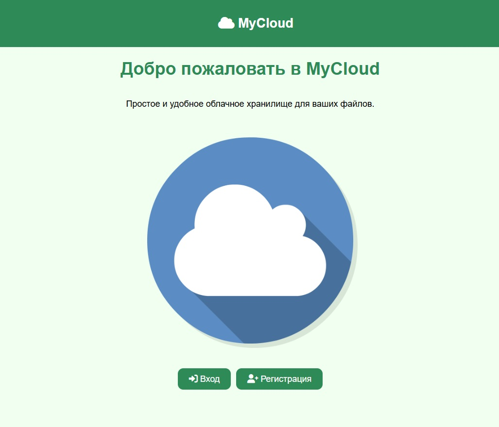
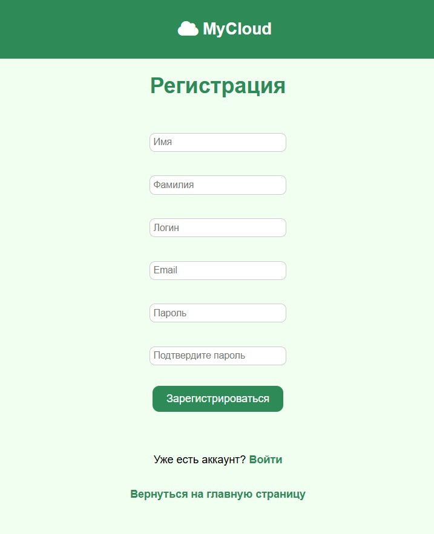
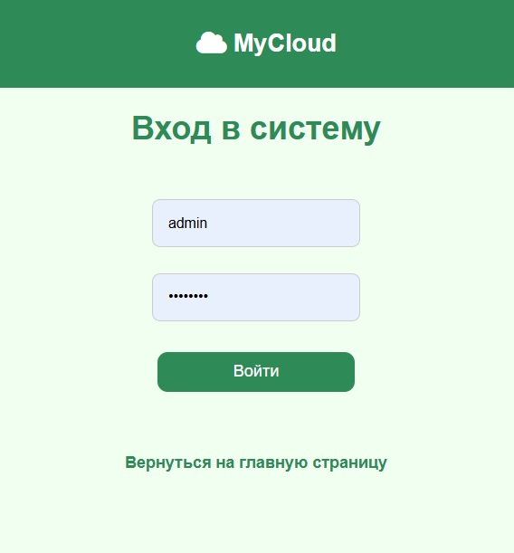
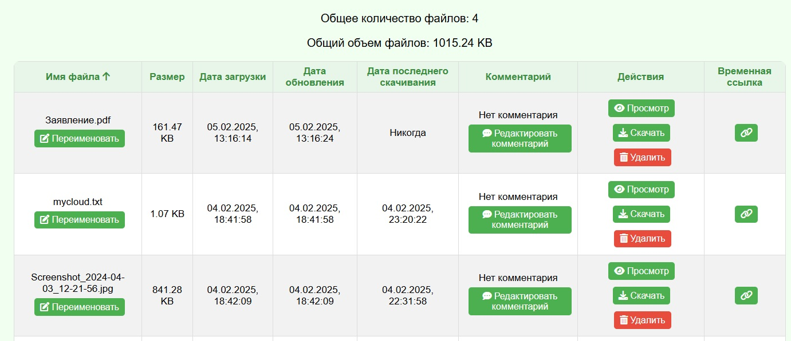
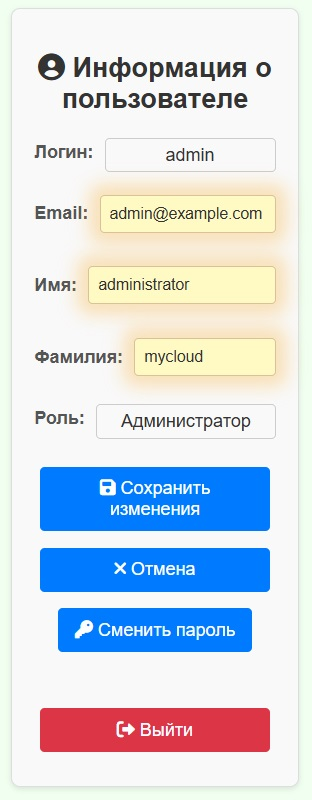
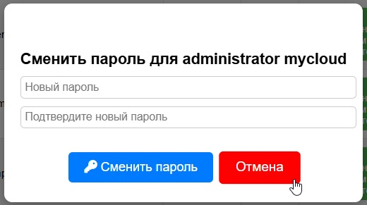
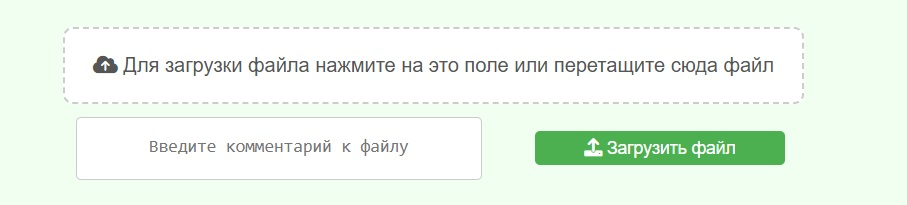
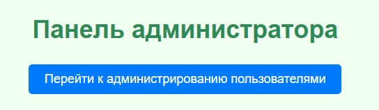
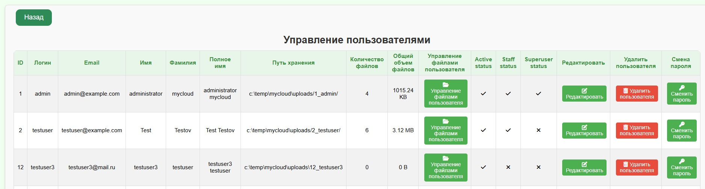
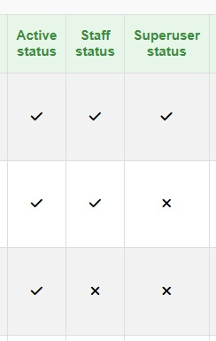

# Инструкция по использованию приложения "My Cloud"

## 📌 Доступ к приложению
Приложение доступно по адресу:  
**[http://<серверный_IP>:3000](http://<серверный_IP>:3000)**

## 🔑 Аутентификация
Пользователи могут выполнить:
- **Регистрацию** (создание нового аккаунта)
- **Вход** (авторизация с уже существующим аккаунтом) 

## 🏠 Личный кабинет (для обычных пользователей)
После входа **обычный пользователь** автоматически попадает на страницу **`/dashboard`**, где ему доступны:
- 📂 **Файлы** — список загруженных пользователем файлов. 

- 🔄 **Переключение отображения файлов** — таблица / плитки (кнопка справа вверху). 

- 🔒 **Панель "Информация о пользователе"** — здесь можно:
  - Изменить личные данные (например, имя)
  - Сменить пароль 
  - Выйти из приложения (**кнопка "Выход"**) 

 

- 📤 **Загрузка файла** — осуществляется двумя способами:
  - **Перетаскиванием (Drag & Drop)** файла в окно браузера.
  - **Выбором файла** через клик на поле "Для загрузки файла". 

## ⚙️ Администрирование (для администраторов)
После входа **администратор** попадает на страницу **`/admin`**, где он получает доступ ко всем тем же элементам, что и обычный пользователь, но у администратора доступна в интерфейсе
- 🔘 **Дополнительная кнопка "Перейти к администрированию пользователями"** 

### 👥 Управление пользователями
При переходе в режим администрирования становится доступна таблица с пользователями: 
 
А также функции:
- 🔄 **Редактирование информации о пользователях**
- 🔑 **Управление правами пользователей** 

- 📂 **Управление файлами пользователей** (просмотр, удаление, редактирование) 
и другие... 
## 🚀 Выход из системы
Чтобы выйти из приложения, воспользуйтесь кнопкой "Выход" в разделе "Информация о пользователе".
